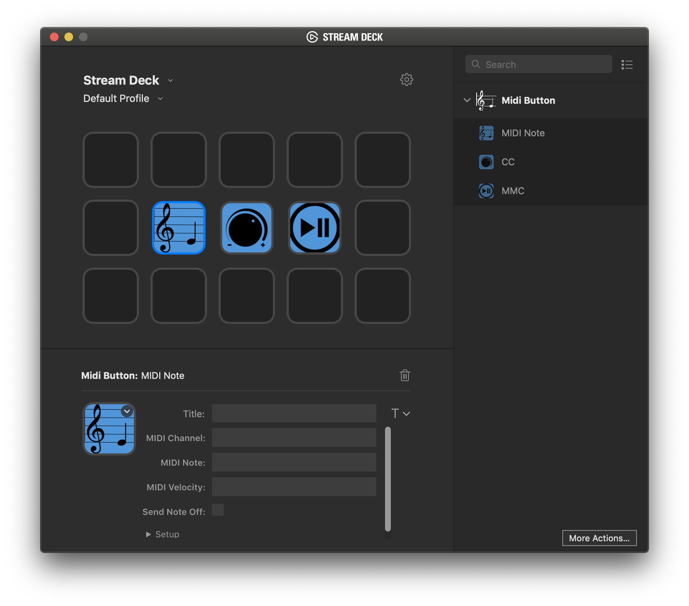

`MIDIbutton` is a plugin to send MIDI messages from the Elgato Streamdeck.

# Description

`MIDIbutton` is a plugin to send MIDI messages (Note On/Off, CC and MMC) from the Elgato Streamdeck. The messages can be customised, and the MIDI port can be renamed. Uses the RtMidi library for MIDI communication.

# Features

- code written in C++
- single-platform (macOS) with plans for a windows port

# Installation

In the Release folder, you can find the file `co.uk.clarionmusic.midibutton.streamDeckPlugin`. If you double-click this file on your machine, Stream Deck will install the plugin.

# Source code

The Sources folder contains the source code of the plugin.
